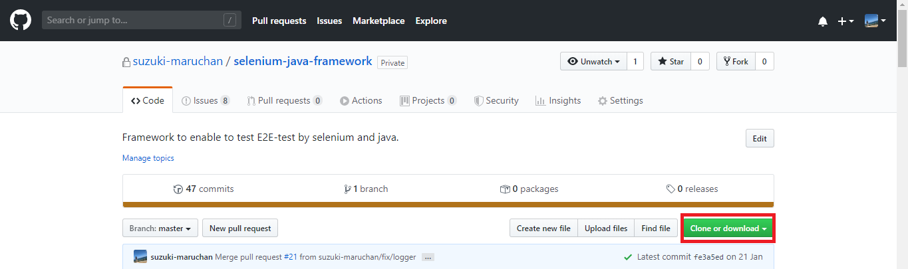

<body>
    

        <h1>ソースのダウンロード</h1>
        
ソースのダウンロード方法を明記する。

    

    

        <ol type="1">
            <li>
                <code>Clone or download</code> をクリック
            </li>
        </ol>
    

    

        <h1><code>Clone or download</code>をクリック</h1>
        

            下記にある<code>Clone or download</code>ボタンをクリックする。 
            
        

    

</body>