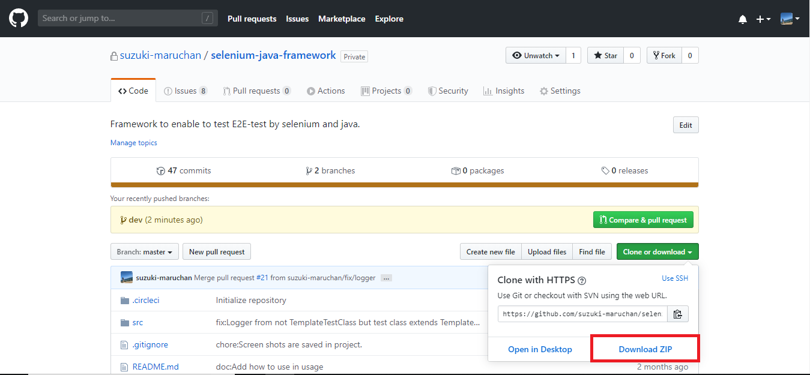

<body>
    

        <h1>ソースのダウンロード</h1>
        
ソースのダウンロード方法を明記する。

    

    

        <ol type="1">
            <li><code>Clone or download</code> をクリック</li>
            <li>Zipとしてダウンロード</li>
            <li>Zipを解凍</li>
        </ol>
    

    

        <h1><code>Clone or download</code>をクリック</h1>
        

            下記にある<code>Clone or download</code>ボタンをクリックする。 
            
        

    

        <h1>Zipとしてダウンロード</h1>
        

            下記にある<code>Download Zip</code>ボタンをクリックする。 
            
        

    

        <h1>Zipを解凍</h1>
        

            ダウンロードしたZipファイルを解凍する。
        

    

    

        <a href="setTestEnvironment.md">次へ</a>
        <a href="../index.md">目次に戻る</a>
    

</body>